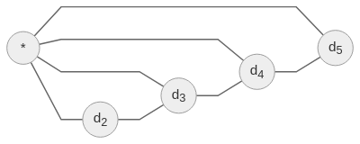
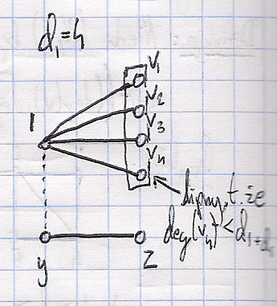
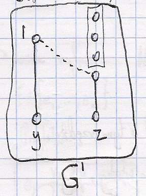
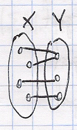
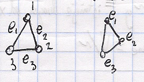

# Wykład 4-03-2020

## $Twierdzenie$ (Havel-Hakimi)

$(d_1,...,d_n)$ - ciąg graficzny\
$\equiv (d_2', d_3',...,d_n')$ - graficzny, gdzie:\
$$
d_i =
\begin{cases}
  d_i - 1: i = 2,..., d_1 + 1\\
  d_i: i = d_1+2,..n
\end{cases}
$$

### Dowód

$\upuparrows$

$d_1 = 3$

rzędy wierzchołków:
$d_2 - 1$\
$d_3 - 1$\
$d_4 - 1$\
$d_5 - 1...$

dołączamy do każdego z powyższych dodatkowy węzeł:

### Przykład $\downdownarrows$

$(3,2,2,2,1)$

$(2,1,1,0)$

$(3,2,2,2,1)$

$(1,1,1,1)$

- Szukamy grafu o wiersz $\{ 1,...,n \}$
- Wybieramy taki graf $G = (\{ 1,...,n \}, E)$, że $\sum_{ \{1,x\} \in E }\deg(x)$ jest największe.\
  $\deg(i) = d_i$

### Oznaczenie sąsiedzi wierzchołka
$\mathcal{N}(x) = \{ y \in V: (\exists e \in E)( \{x,y\} \in \phi(e) ) \}$

### Claim

$\{ \deg(y): y\in \mathcal{N}(1) \} = \{ d_2, d_3,..., d_{d_1 +1} \}$

Zał. że **nie**

Jest $x \in \mathcal{N}(1)$ takie, że $\deg(x) < \deg(d_{1+d_1})$

#### Przykład

$d_1 = 4$

$v_4 \leftarrow$ lipny, taki, że $\deg(v_4) < d_{1 + d_1}$

Jest $y$ taki, że
1. $y \notin \mathcal{N}(1)$
2. $\deg(y) > \deg(v_4)$

Jest $z$ taki, że
1. $z \in \mathcal{N}(y)$
2. $z \notin \mathcal{N}(v_4)$

$G'$:
1. $\deg(1) = \deg_6(1) = 4$
2. $\mathcal{N}(1) = \{ v_1, v_2, v_3, y \}$\
  2'. $\deg_{6'}(y) = \deg_6(y)$
3. $\sum_{u \in \mathcal{N}(1)}\deg(u) ? \sum_{u \in \mathcal{N}(1)}\deg_G(u)$

Czyli jest graf $G$ na $\{ 1,...,n \}$ taki, że:\
1. jego $\deg$, to $(d_1,...,d_n)$
2. $\mathcal{N}(1) = \{2,3,...,d_1+1\}$\
   $\deg(i) = d_i~dla~i =2,...,d_1+1$
$\blacksquare$

## Graficzne ZOO

- graf zupełny: $K_n \cong (\{1,...,n\}, [\{1,...,n\}]^2)$\
  
- graf pusty: $E_n \cong (\{1,...,n\}, \emptyset)$
- graf liniowy: $L_n = ( \{1,...,n\}, \{\{i,i+1\}: i = 1,...,n-1\} )$\
  
- graf cykliczny: $C_N$ - jak liniowy, ale połączony w cykl \<insert graph\>\
  
- graf $(V,E)$ jest dwudzielny, jeśli istnieją $X,Y$ takie, że:
  1. $X\cup Y = V \land X \cap Y = \emptyset \land X \neq \emptyset \land Y \neq \emptyset$
  2. $E \subseteq \{ \{x,y\}: x \in X \land y \in Y \}$

    

    $K_{n,m} = (X\cup Y, \{\{x,y\}: x \in X, y \in Y\})$\
    $|X| = n, |Y| = m$

## Operacje (grafy proste)

Mamy $G(V,E)$

1. Dopełnienie: $\overline{G}=(V, [V]^2\setminus E)$; uwagi:
   1. $\overline{K_n} = E_n$
2. Usunięcie krawędzi: $e \in E$: $G\setminus e = (V, E \setminus \{e\})$
3. Usunięcie węzła: $x \in V$: $G - x = (V \setminus\{x\}, E \cap [V \setminus \{x\}]^2)$

## Przykład Grafu Petersena

$\forall x \in V~~deg(x) =3$ jest to graf regularny $\equiv (\exists c)(\forall x \in V)(\deg(x) = c)$

**graf kubiczny** $\equiv$ 3-regularny

## $Definicja$ Graf Krawędziowy

Niech $G = (V,E)$ będzie grafem prostym.\
Grafem krawędziowym grafu $G$ nazywamy
$$
L(G) = (E, \{\{L,K\}\in [E]^2: L\cap K \neq \emptyset\})
$$

### Przykład

$L(K_3) \simeq K_3$

Konstrukcja:

- $K_5 = (\{0,1,2,3,4\}, [0...4]^2)$

  Tu mamy $\binom{5}{2} = \frac{5*4}{2} = 10$ krawędzi.
- $L(K_5)=(\{0...4\}^2, \{\{A,B\}\in[[0,4]^2]^2: A\neq B \land A \cap B \neq \emptyset\})$
- $\overline{L(K_5)} = (\{\{0...4\}^2: [\{0...4\}^2]^2: A \neq B \land A \cap B = \emptyset\})$
- Fakt: $L(K_5) \cong$ graf Petersena

## Hiper-kostka

$H_n = (\{(i_1,...,i_n): i_1,...,i_n \in \{0,1\}\}, \{\{\overline{x}, \overline{y}\}:(\exists i)(\overline{x}(i) \neq \overline{y}(i)\land (\forall j)(\overline{x}(j) = \overline{y}(j)))\})$

### Przykład

$n = 3$ $(i_1, i_2, i_3)$

$H_2$

$H_3$

- Suma grafów\
  $G_1=(V_1, E_1)$, $G_2 = (V_2, E_2)$; $V_1 \cap V_2 = \emptyset$\
  $G_1 + G_2 = (V_1 \cup V_2, E_1 \cup E_2)$
- Złączenie grafów $G_1$ oraz $G_2$:
  - $G_1*G_2 = (V_1 \cup V_2, E_1 \cup E_2 \cup \{\{x,y\}: x \in V_1 \land y \in V_2\})$
  - Przykład: $E_3 * E_2 = K_{3,2}$

## $Definicja$

Ustalmy grafy $G=(V,E,\phi)$
1. Trasa w grafie $G$
   - ciąg $x_0e_1x_1e_1...x_ne_n$ taki że
     - $x_0,...,x_n \in V$
     - $e_1,...,e_n \in E$
     - $\{x_i, x_{i+1}\} = \phi(e_{i+1})$ $i = 0...(n-1)$
     - 
2. Ścieżka: trasa bez powtórzonych krawędzi
3. Droga: ścieżka bez powtórzonych wierzchołków
4. Cykl: ścieżka taka, że $x_0 = x_n$
5. Cykl elementarny: $(x_0x_1...x_{n-1}x_n) = x_0$ przy czym $(x_0x_1...x_{n-1}x_n)$ to jest droga

Nazewnictwo:
| $\equiv$ | $\equiv$ | $\equiv$          |
| -------- | -------- | ----------------- | -------------- |
| trasa    | trail    | droga             | trasa          |
| ścieżka  | walk     | droga prosta      | ścieżka        |
| droga    | path     | droga elementarna | ścieżka prosta |

## Fakt $\circlearrowleft$

1. Jest trasa od $x$ do $y$
2. Jest droga od $x$ do $y$

## Składowe spójne

Mamy graf $G=(V,E, \phi)$.

Na $V$ określamy relację:\
$x \sim y \iff$ kiedy istnieje droga od $x$ do $y$

**Fakt: $\sim$ jest to relacja równoważności**

Terminologia: składowe spójne $\equiv V_{/\sim}$\
$c(G) = |V_{/\sim}|$

$G$ jest spójny $\equiv$ $c(G) = 1$

## $Twierdzenie$
Niech $G=(V,E)$ będzie grafem prostym.

Jeśli $G$ jest spójny to $|E| \ge |V| - 1$

### Dowód

$n=1$ $\rightarrow$ OK\
$n=2$ $\rightarrow$ OK

Załóżmy, że dla grafów takich, że $|V| = n$ to jest OK\
Niech $(V,E)$ będzie spójny, $|V| = n+1$ ale $|E| < |V| - 1 = (n+1) -1 = n$, czyli $|E| \le n-1$

#### Claim: jest $X \in V$ takie, że $\deg(x) = 1$
Załóżmy, że $(\forall x \in V)(\deg(x) \ge 2)$

$$
(n+1)*2 \le \sum_{x\in V}\deg(x) = 2|E| \le 2(n-1)
$$

$V_1 = V \setminus \{x\},~|V_1| = n$\
$G_1 = G \setminus \{x\}$ $\leftarrow$ spójny
