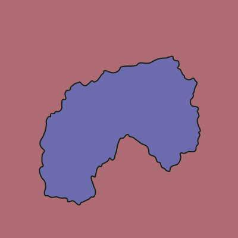
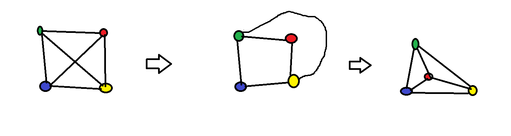
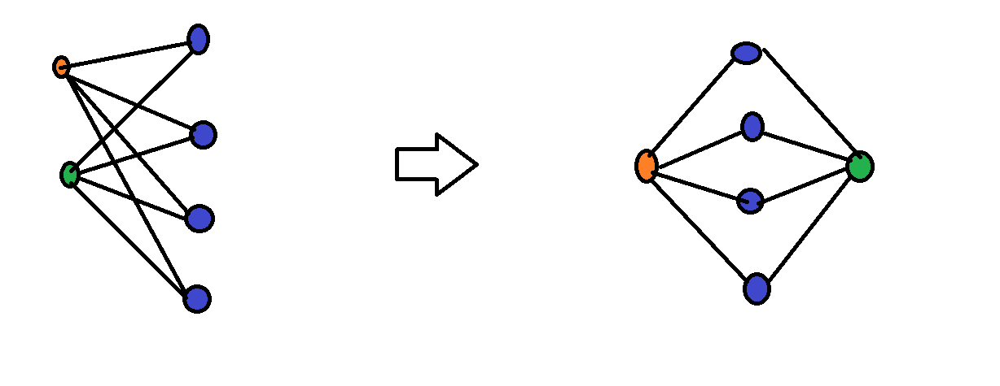
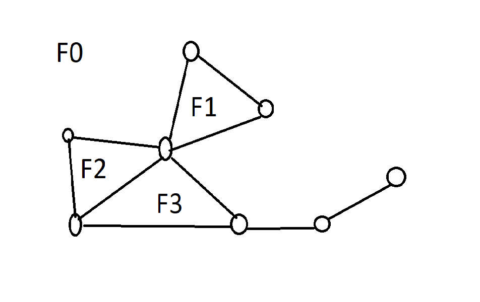
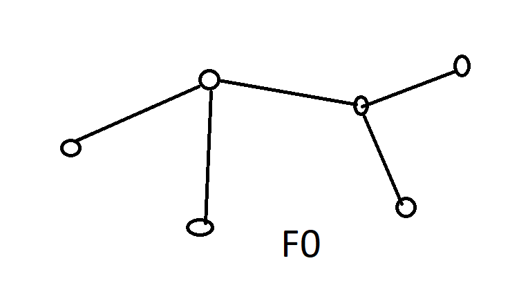
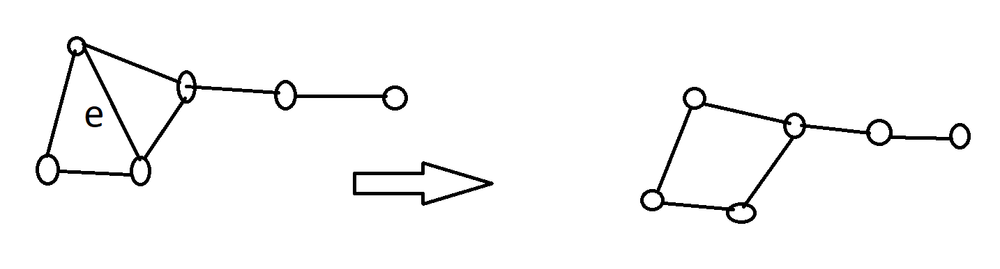

---

- [Kilka pojęć pomocniczych](#kilka-pojęć-pomocniczych)
    - [Krzywa w $\reals^n$](#krzywa-w-realsn)
    - [Krzywa Jordana](#krzywa-jordana)
    - [$Twierdzenie$ o krzywej Jordana](#twierdzenie-o-krzywej-jordana)
- [$\text{Definicja}$ **graf planarny**](#textdefinicja-graf-planarny)
    - [$\text{Uwagi}$ co do grafów planarnych](#textuwagi-co-do-grafów-planarnych)
- [$\text{Twierdzenie}$ Grafy $K_{3,3}$ oraz $K_5$ nie są planarne](#texttwierdzenie-grafy-k_33-oraz-k_5-nie-są-planarne)
- [Reprezentacja planarna grafu](#reprezentacja-planarna-grafu)
- [$\text{Twierdzenie}$ Eulera](#texttwierdzenie-eulera)
- [D-d $\text{Twierdzenia}$ Eulera](#d-d-texttwierdzenia-eulera)
- [Wniosek z $\text{Twierdzenia}$ Eulera](#wniosek-z-texttwierdzenia-eulera)
- [$\text{Twierdzenie}$ liczba krawędzi w planarnym grafie](#texttwierdzenie-liczba-krawędzi-w-planarnym-grafie)
    - [D-d $\text{Twierdzenia}$ liczba krawędzi w planarnym grafie](#d-d-texttwierdzenia-liczba-krawędzi-w-planarnym-grafie)
    - [Wniosek $\text{Twierdzenia}$ liczba krawędzi w planarnym grafie](#wniosek-texttwierdzenia-liczba-krawędzi-w-planarnym-grafie)
    - [Graf $K_5$ nie jest planarny](#graf-k_5-nie-jest-planarny)
    - [Graf $K_{3,3}$ nie jest planarny](#graf-k_33-nie-jest-planarny)
- [$\text{Twierdzenie}$ #1](#texttwierdzenie-1)
    - [D-d $\text{Twierdzenia}$ #1](#d-d-texttwierdzenia-1)

---

## Kilka pojęć pomocniczych

### Krzywa w $\reals^n$

Dowolne ciągłe odwzorowanie $\gamma:[a,b] \rightarrow \reals^n$

### Krzywa Jordana

taka krzywa $\gamma:[a,b] \rightarrow \reals^n$, że $\gamma(a) = \gamma(b)$ oraz, że $\gamma$ jest różnowartościowe na przedziale $(a,b)$.

Wyobrażać ją sobie możemy jako pętlę bez przecięć.

### $Twierdzenie$ o krzywej Jordana

Każda [krzywa Jordana](#krzywa-jordana) rozdziela płaszczyznę na dwa rozłączone obszary i jest ich wspólnym brzegiem.

## $\text{Definicja}$ **graf planarny**

Graf $G=(V,E)$ jest **grafem planarnym** jeśli jego wierzchołki możemy przedstawić jako punkty płaszczyzny, a krawędzie jako krzywe na płaszczyźnie łączące wierzchołki, przy czym punktami wspólnymi dwóch różnych krawędzi mogą być tylko ich końcowe wierzchołki.

Poniżej widzimy, że graf $K_4$ jest **grafem planarnym**.

Graf $K_{2,4}$ również jest planarny.

### $\text{Uwagi}$ co do grafów planarnych

1. Dosyć łatwo można pokazać, że w pojęciu planarności pojęcie łuku można zastąpić krzywymi łamanymi, czyli takimi, które rozbijają się na skończoną liczę odcinków. Od tej pory zawsze będziemy stosowali takie reprezentacje grafów planarnych.
2. Można również pokazać, że dowolne krzywe można zastąpić odcinkami. Widzieliśmy to na dwóch powyższych rysunkach.

## $\text{Twierdzenie}$ Grafy $K_{3,3}$ oraz $K_5$ nie są planarne

[Nieformalny dowód $K_{3,3}$ jest nie-planarny](https://youtu.be/wnYtITkWAYA?t=190)

Udowodnimy to $Twierdzenie$ w późniejszej części tego wykładu.

## Reprezentacja planarna grafu

Niech $G$ będzie zbiorem punktów i krawędzi.\
Jest to zbiór domknięty.\
Zbiór $\reals^2 \setminus G$ rozkłada się na spójne składowe zwane regionami *(ścianami)*:

Przykładowo, tutaj mamy **4 regiony** *(ściany)* przy czym region $F_0$ jest nieograniczony.

W przypadku drzewa istnieje tylko jeden region *(ściana)*:

## $\text{Twierdzenie}$ Eulera

Niech $F$ oznacza liczbę regionów *(ścian)*, $E$ liczbę krawędzi oraz $V$ liczbę wierzchołków spójnego [grafu planarnego](#textdefinicja-graf-planarny).\
**Wówczas mamy $F - E + V = 2$**.

## D-d $\text{Twierdzenia}$ Eulera

Ustalmy liczbę $V$. Dowód robimy indukcją po liczbie krawędzi. Ze spójności grafu wynika, że $E \ge V-1$.

Jeśli $E=V-1$, to graf jest drzewem, nie ma więc cyklu, więc ma tylko jeden region *(ścianę)*.
Oczywiście wówczas mamy faktycznie
$$
F - E + V = 1 - (V-1) + V = 2
$$

Załóżmy więc, że $E>V-1$. Wtedy graf ma cykl. Niech $e$ będzie krawędzią z tego cyklu. Krawędź $e$ leży na brzegu dwóch ścian *(jedną z nich może być region nieograniczony)*.\
Usuńmy $e$ z grafu:

Liczba $E$ zmalała o jeden, liczba $F$ zmalała o jeden, a liczba $V$ nie uległa zmianie. Wartość wyrażenia $F - E + V$ nie uległa więc zmianie. Więc jest nadal równa $2$.

## Wniosek z $\text{Twierdzenia}$ Eulera

**Wszystkie planarne realizacje grafu spójnego mają taką samą liczbę ścian.**

## $\text{Twierdzenie}$ liczba krawędzi w planarnym grafie

Niech $G$ będzie prostym grafem planarnym $V\ge3$.\
Wówczas
$$
E \le 3\cdot V - 6
$$
a jeśli graf nie zawiera trójkątów to
$$
E \le 2\cdot V - 4
$$

### D-d $\text{Twierdzenia}$ liczba krawędzi w planarnym grafie

1. Ogólnie (kiedy mamy trójkąty)
   1. Zauważmy, że każdy region *(ściana)* ograniczony jest co najmniej trzema krawędziami. Zauważmy również, że każda krawędź leży na brzegu co najwyżej dwóch regionów *(ścian)*. Zatem
       $$
       3 \cdot F \le 2 \cdot E
       $$
       Zróbmy dokładniej:
       1. Niech $F_1,\dots,F_y$ będą regionami *(ścianami)*.
       2. Niech $f_i,~i=1,\dots,y$ oznacza liczbę krawędzi na regionie *(ścianie)* $F_i$.
       3. Niech $e_1,\dots,e_m$ będą krawędziami
       4. Wówczas mamy
           $$
           3 \cdot F = 3 \cdot y \le \sum_{i=1}^{y}f_i = \sum_{i=1}^{y}\sum_{j=1}^{m}\lVert e_j~\text{jest incyndentna z}~f_j\rVert=\\
           \sum_{j=1}^{m}\sum_{i=1}^{y}\lVert e_j~\text{jest incydentna z}~f_j\rVert \le \sum_{j=1}^{m} = 2\cdot m = 2\cdot E
           $$
   2. Użyjmy [równości Eulera](#texttwierdzenie-eulera) $2 = F - E + V$
   3. Pomnóżmy ją przez $3$ i zastosujmy poprzednią nierówność
   $$
   6 = 3F - 3E + 3V \le 2E - 3E + 3V = -E + 3V
   $$
   [dowód dr Sarada Herke](https://www.youtube.com/watch?v=_d_6JvceAwE)

2. W przypadku kiedy nie mamy trójkątów
   1. Zauważmy, że każdy region *(ściana)* ograniczony jest co najmniej czterema krawędziami. Zauważmy również, że każda krawędź leży na brzegu co najwyżej dwóch regionów *(ścian)*. Zatem
       $$
       4 \cdot F \le 2 \cdot E
       $$
       Zróbmy dokładniej:
       1. Niech $F_1,\dots,F_y$ będą regionami *(ścianami)*.
       2. Niech $f_i,~i=1,\dots,y$ oznacza liczbę krawędzi na regionie *(ścianie)* $F_i$.
       3. Niech $e_1,\dots,e_m$ będą krawędziami
       4. Wówczas mamy
           $$
           4 \cdot F = 4 \cdot y \le \sum_{i=1}^{y}f_i = \sum_{i=1}^{y}\sum_{j=1}^{m}\lVert e_j~\text{jest incyndentna z}~f_j\rVert=\\
           \sum_{j=1}^{m}\sum_{i=1}^{y}\lVert e_j~\text{jest incydentna z}~f_j\rVert \le \sum_{j=1}^{m} = 2\cdot m = 2\cdot E
           $$
   2. Użyjmy [równości Eulera](#texttwierdzenie-eulera) $2 = F - E + V$
   3. Pomnóżmy ją przez $4$ i zastosujmy poprzednią nierówność
   $$
   \begin{aligned}
   8 = 4F - 4E + 4V \le&~ 2E - 4E + 4V = -2E + 4V\\
   4 \le&~ -E + 2V\\
   E \le&~ 2 V - 4
   \end{aligned}
   $$

### Wniosek $\text{Twierdzenia}$ liczba krawędzi w planarnym grafie

Liczba krawędzi w grafie planarnym jest dosyć mała, bo ograniczyć ją można przez $3V$, czyli jest rzędu $O(V)$ - to bardzo przydaje się w geometrii obliczeniowej.

### Graf $K_5$ nie jest planarny

Gdyby był planarny to $10 = E \le 3V - 6 = 3\cdot 5 - 6 = 9$.

### Graf $K_{3,3}$ nie jest planarny

Gdyby był planarny to $9 = E \le 2V - 4 = 2 \cdot 6 - 4 = 8$.

## $\text{Twierdzenie}$ #1

Załóżmy, że $G = (V,E)$ jest [grafem planarnym](#textdefinicja-graf-planarny).
Wtedy istnieje wierzchołek $v$ taki, że $\deg(v) \le 5$

Ta własność przyda nam się, gdy będziemy zajmowali się kolorowaniem grafów.

### D-d $\text{Twierdzenia}$ #1

Załóżmy, że $(\forall v\in V)(\deg(v) \ge 6)$.\
Wówczas
$$
6 \cdot \lvert V\rvert \le \sum_{v\in V} \deg(V) = 2\cdot E \le 2\cdot (3 \cdot \lvert V \rvert -2) = 6 \cdot \lvert V \rvert - 6
$$
Otrzymaliśmy więc sprzeczność.
