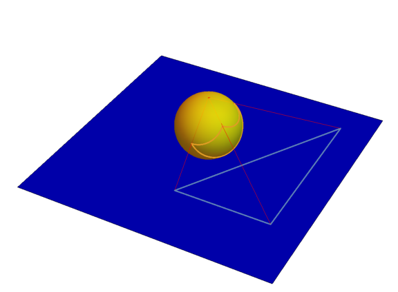

---

- [Rzut stereograficzny](#rzut-stereograficzny)
- [$\text{Fakt}$ #1](#textfakt-1)
- [Bryła platońska *(wielościan foremny)*](#bryła-platońska-wielościan-foremny)
- [$\text{Twierdzenie}$ #1](#texttwierdzenie-1)
    - [D-d $\text{Twierdzenia}$ #1](#d-d-texttwierdzenia-1)
- [$\text{Definicja}$ Rozdrobnienie grafu](#textdefinicja-rozdrobnienie-grafu)
- [$\text{Fakt}$ #2](#textfakt-2)
- [$\text{Twierdzenie}$ #2 (Kuratowski)](#texttwierdzenie-2-kuratowski)

---

## Rzut stereograficzny

**Ciągła bijekcja między płaszczyzną a sferą bez jednego punktu.**

Tak wygląda rzut stereograficzny trójkąta z płaszczyzny na sferę:

## $\text{Fakt}$ #1
Grafy planarne są tym samym co grafy *„bez przecięć”* na sferze

*Uwaga: teraz wyraźniej widać dlaczego do regionów (ścian) grafu planarnego dołączamy również tę ścianę nieograniczoną: ona staje się „normalną ścianą” na sferze.*

## Bryła platońska *(wielościan foremny)*
Wielościan o następujących własnościach:
1. jest **wypukły**
2. każdy **wierzchołek** jest tego **samego rzędu**
3. wszystkie ściany *(regiony)* są przystającymi wielokątami foremnymi.

*Przykłady: [sześcian, czworościan foremny](../../cw/lista-4/lista-4.md#zadanie-43-świąteczne)*

## $\text{Twierdzenie}$ #1
**Jest pięć brył platońskich.**

### D-d $\text{Twierdzenia}$ #1

Oznaczenia:
- $n =$ rząd (każdego) wierzchołka
- $m =$ liczba krawędzi (każdej) ściany
- $F =$ liczb ścian *(regionów)*
- $E =$ liczba krawędzi
- $V =$ liczba wierzchołków

Mamy:
1. $n \ge 3, m \ge 3$
2. $n \cdot V = 2 \cdot E$ [(wzór Eulera)](../2020-04-01/2020-04-01.md#texttwierdzenie-eulera)
3. $m \cdot F = 2 \cdot E$ (każda krawędź jest na brzegu dwóch ścian)
4. $F - E + V = 2$ [(wzór Eulera)](../2020-04-01/2020-04-01.md#texttwierdzenie-eulera)

Zatem
$$
2 = \frac{2E}{m} - F + \frac{2E}{n} = E\left(\frac{2}{m} - 1 + \frac{2}{n}\right)
$$
Z tego mamy $\frac{2}{m} - 1 + \frac{2}{n} > 0$, zatem $\frac{2}{m} > \frac{2}{n} \ge \frac{2}{3}$, więc $m < 6$.\
Podobnie mamy $n < 6$. Zatem $m,n \in \{3,4,5\}$.

Ograniczyliśmy więc liczbę możliwości do $9$. Dalej będziemy eliminować niemożliwe przypadki.

1. Przypadek $m = 3$:\
    (ściany są trójkątami)

    mamy $2 = E\left(\frac{2}{3} - 1 + \frac{2}{n}\right)$, czyli $2 = E\left(\frac{2}{n} - \frac{1}{3}\right)$;

    - dla $n = 3$:\
      otrzymujemy $E = 6$ (to jest czworościan foremny)
    - dla $n = 4$:\
      otrzymujemy $E = 12$ (to jest ośmiościan foremny)
    - dla $n = 5$:\
      otrzymujemy $E = 30$ (to jest dwudziestościan foremny)
2. Przypadek $m = 4$:\
    (ściany są kwadratami)

    bez trudu sprawdzamy, że to nam daje sześcian
3. Przypadek $m = 5$:\
    (ściany są pięciokątami foremnymi)

    otrzymamy dwunastościan foremny

*Polskie nazwy: czworościan foremny, sześcian, ośmiościan foremny, dwunastościan foremny, dwudziestościan foremny*

## $\text{Definicja}$ Rozdrobnienie grafu
Rozdrobnieniem grafu $G$ nazywamy graf, który otrzymuje się z grafu $G$ przez **zamianę jego krawędzi drogą o jednej lub więcej krawędzi**.

## $\text{Fakt}$ #2
Niech $G'$ będzie rozdrobnieniem grafu $G$. Graf $G$ jest planarny $\iff$ graf $G'$ jest planarny.

## $\text{Twierdzenie}$ #2 (Kuratowski)
Graf nie jest planarny $\iff$ zawiera rozdrobnienie grafu $K_{3,3}$ $\lor$ zawiera rozdrobnienie grafu $K_5$.

Twierdzenie to pokazuje, że $K_{3,3}$ oraz $K_5$ są kanonicznymi przykładami grafów nieplanarnych.
