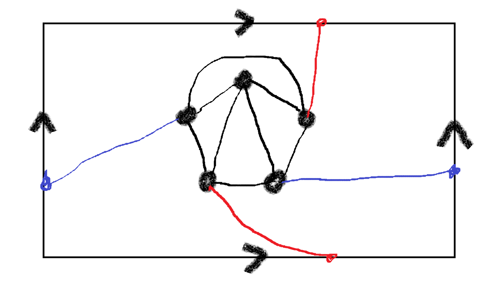
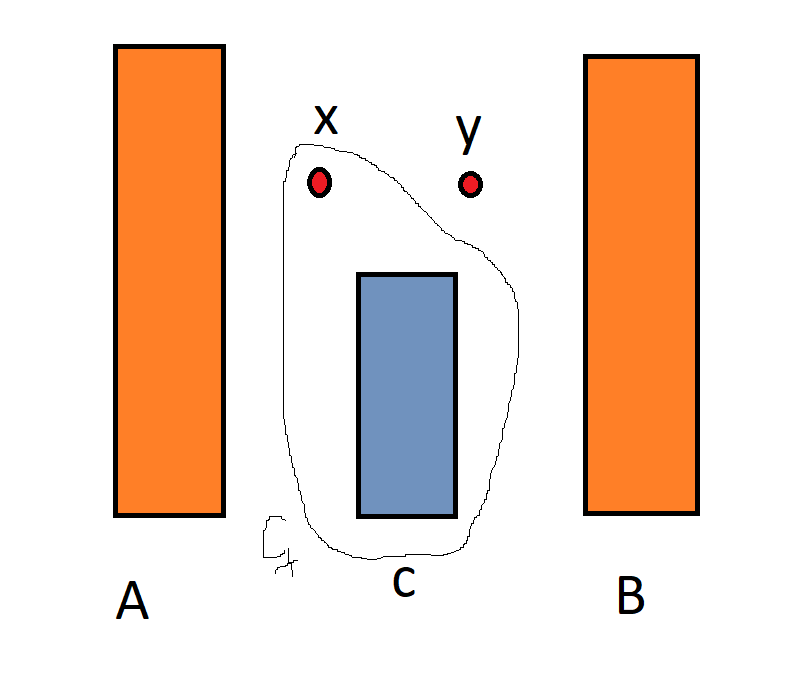

# Twierdzenie Mengera
*(2020-04-22)*

## Graf $K_5$ na torusie

## $\text {Fakt}$ #1

Niech $\mathcal{P}$ będzie [$(A,B)$–konektorem](../2020-04-15/grafy-planarne-3-spójność.md#text-definicja-ab%e2%80%93konektor) oraz $X$ będzie [$(A,B)$–separatorem](../2020-04-15/grafy-planarne-3-spójność.md#text-definicja-ab%e2%80%93separator).\
Wówczas $|\mathcal{P}| \le |X|$.

## Oznaczenia

Dla grafu prostego $G$ definiujemy:
1. $\lambda_G(A,B)$ — największa moc [$(A,B)$–konektora](../2020-04-15/grafy-planarne-3-spójność.md#text-definicja-ab%e2%80%93konektor)
2. $\kappa_G(A,B)$ — najmniejsza moc [$(A,B)$–separatora](../2020-04-15/grafy-planarne-3-spójność.md#text-definicja-ab%e2%80%93separator)

## Wniosek #1

Jeśli $G = (V,E)$ jest grafem prostym oraz $A,B \subseteq V$ to $\lambda_G(A,B) \le \kappa_G(A,B)$.

## $\text {Twierdzenie}$ #1
Jeśli $G = (V,E)$ jest grafem prostym oraz $A,B\subseteq V$ to $\lambda_G(A,B) = \kappa_G(A,B)$.

### D-d $\text {Twierdzenia}$ #1

**Część I**

Zakładamy, że $A \cap B = \emptyset$.

Przeprowadzimy go indukcją względem $|E|$. Dla $|E| = 0$ twierdzenie jest prawdziwe (zarówno separatory jak i konektory są puste).

Rozważmy więc graf prosty $(G,E)$ i załóżmy, że dla wszystkich grafów postaci $(V,E')$ takich, że $|E'| < |E|$ twierdzenie jest prawdziwe.

1. Niech $k = \kappa_G(A,B)$. Naszym celem jest pokazanie, że istnieje $(A,B)$–konektor mocy $k$. Niech $e = \{x,y\} \in E$ i niech $G' = (V,E\setminus\{e\})$.
2. Jeśli $k = \kappa_{G'}(A,B)$ to w grafie $G'$ mamy $(A,B)$–konektor, który oczywiście jest $(A,B)$–konektorem w grafie $G$. Możemy więc założyć, że $\kappa_{G'}(A,B) < k$.
3. Niech $C$ będzie $(A,B)$–separatorem w grafie $G'$. Mamy $|C| < k$. Niech $C_x = C\cup \{x\}$.\

4. Claim: $C_x$ jest $(A,B)$–separatorem w grafie $G$\
d-d claimu: rozważmy dowolną $(A,B)$–ścieżkę $\mathcal{P}$ w grafie $G$. Jeśli $\mathcal{P}$ jest $(A,B)$–ścieżką w grafie $G'$ to $\mathcal{P} \cap C \neq \emptyset$. Jeśli zaś $e$ występuje w $\mathcal{P}$, to $x \in \mathcal{P}$, więc $\mathcal{P} \cap C_x \neq \emptyset$. Zatem w obu przypadkach $\mathcal{P} \cap C_x \neq \emptyset$.
5. Z poprzedniego claimu wynika, że $|C_x| \ge k$, zatem $|C| = k-1$ i $x \notin C$.
6. Podobnie pokazujemy, że zbiór $C_y = C\cup \{y\}$ jest $(A,B)$–separatorem w grafie $G$.
7. Wiemy, że $\kappa_{G'}(A,B) < \kappa_G(A,B)$. W grafie $G$ istnieć więc musi $(A,B)$–ścieżka zawierająca krawędź $e$.\
Na ścieżce tej występują oba wierzchołki $x,y$. Możemy założyć, że pierwszym wystąpieniem któregoś z tych dwóch elementów jest $x$.\
Możemy więc założyć, że w grafie $G'$ jest $(A,\{x\})$–ścieżka oraz, że w grafie $G'$ jest $(\{y\}, B)$–ścieżka. W grafie $G'$ nie ma zaś ścieżki od $x$ do $y$, gdyż inaczej $C$ nie byłby zbiorem $(A,B)$–separującym w $G'$.
8. Claim: Każdy $(A,C_x)$–separatorem w grafie $G'$ jest $(A,B)$–separatorem w grafie $G$.

    D-d claimu:

    Niech $Z$ będzie $(A,C_x)$–separatorem w grafie $G'$. Rozważmy dowolną $(A,B)$–ścieżkę $\mathcal{P}$ w grafie $G$. Niech $\mathcal{P}'$ będzie pod-ścieżką ścieżki $\mathcal{P}$ zaczynającą się od elementu zbioru $A$ i kończącą się na pierwszym elemencie zbioru $C_x$. Niech $t$ będzie ostatnim elementem tej pod-ścieżki. Rozważmy dwa przypadki:
    - $t\in C$: wtedy $\mathcal{P}'$ jest $(A,C_x)$–ścieżką w $G'$, więc $\mathcal{P}' \cap Z \neq \emptyset$
    - $t = x$: na ścieżce $\mathcal{P}'$ nie ma elementu $y$, więc nie ma również krawędzi $\{x,y\}$; więc ponownie $\mathcal{P}'$ jest $(A,C_x)$–ścieżką w grafie $G'$, więc ponownie $\mathcal{P}'\cap Z\neq \emptyset$.
9. Wniosek: $\kappa_{G'}(A,C_x) = k$\
    d-d: Zbiór $C_x$ jest $(A,C_x)$–separatorem w $G'$. Minimalna moc $(A,C_x)$–separatora jest więc mniejsza lub równa $|C_x| = k$. Ale nie może być ona ostro mniejsza od $k$, gdyż każdy $(A,C_x)$–separator w $G'$ jest $(A,B)$–separatorem w $G$.
10. Istnieje więc $(A,C_x)$–konektor mocy $k$. Podobnie: istnieje $(C_y,B)$–konektor mocy $k$.\
**Łączymy je i otrzymujemy $(A,B)$–konektor mocy $k$.**

**Część II**: $A\cap B \neq \emptyset$

Niech $C = A \cap B$, $A' = A\setminus C$, $B' = B\setminus C$. Stosujemy udowodnione twierdzenie dla rozłącznych zbiorów $A$ i $B$ do grafu $G' = G \setminus C$. W $G'$ znajdujemy $(A', B')$–konektor $\mathcal{P}'$ i $(A', B')$–separator $S$ tej samej mocy.\
Wówczas $\mathcal{P}' \cup C$ jest $(A,B)$–konektorem w grafie $G$ oraz $Z \cup C$ jest $(A,B)$–separatorem w $G$ i oba te zbiory mają tą samą moc.

---
Powyższy dowód jest rozwinięciem [dowodu Goringa](https://www.sciencedirect.com/science/article/pii/S0012365X00000881). Zrozumienie wszystkich detali tego dowodu może być bardzo *time-consuming*.

## $\text {Definicja}$ Ścieżki wewnętrznie rozłączne

Dwie ścieżki $x_0 = a,x_1,x_2,\dots,x_{n-1},x_n = b$ oraz $y_0 = a,y_1,y_2,\dots,y_{m-1},y_m = b$ nazywamy wewnętrznie rozłączne jeśli $\{x_1,\dots,x_{n-1}\} \cap \{y_1,\dots,y_{n-1}\} = \emptyset$.

## $\text {Twierdzenie}$ Mengera (wersja wierzchołkowa)

Niech graf $G = (V,E)$ będzie grafem prostym, $x,y \in V$ i $\{x,y\} \notin E$.\
Wówczas następujące dwie liczby są równe:
1. Maksymalna liczba $xy$–ścieżek parami wewnętrznie rozłącznych
2. Minimalna moc zbioru $X \subseteq V \setminus \{x,y\}$ takiego, że dla każdej $xy$–ścieżki $P$ mamy $X\cap P \neq \emptyset$

*Zadanie: dlaczego w powyższym twierdzeniu zakładamy, że $\{x,y\} \notin E$?*\
rozwiązanie: jeśli $\{x,y\} \in E$ to stworzenie takiego zbioru $X$ z punktu `2.` jest nie możliwe, bo nie możemy używać wierzchołków $x,y$ a na ścieżce $x\rightarrow y$ nie innych wierzchołków.

### D-d $\text {Twierdzenia}$ Mengera (wersji wierzchołkowej)

Niech $A = \mathcal{N}(x)$ i $B = \mathcal{N}(y)$. Na mocy [poprzedniego twierdzenia](#text-twierdzenie-1) mamy $(A,B)$–konektor i $(A,B)$–separator tej samej mocy. Każdą ścieżkę ze znalezionego $(A,B)$–konektora możemy poprawić (jeśli trzeba) do ścieżki bez elementów $x$ i $y$. Znaleziony $(A,B)$–separator nie może więc zawierać ani $x$ ani $y$. Aby zakończyć dowód należy do wszystkich ścieżek ze znalezionego $(A,B)$–konektora dokleić na początku $x$ i na końcu $y$.

## $\text {Twierdzenie}$ Mengera (wersja krawędziowa)

Niech graf $G = (V,E)$ będzie grafem prostym, $x,y \in V$. Wówczas następujące dwie liczby są równe:
1. Maksymalna liczba $xy$–ścieżek parami krawędziowo rozłącznych
2. Minimalna moc zbioru krawędzi $Y \subseteq E$ takiego, że każda $xy$–ścieżka zawiera jakąś krawędź z $Y$

### D-d $\text {Twierdzenia}$ Mengera (wersji krawędziowej)

Stosujemy [udowodnione twierdzenie](#d-d-text-twierdzenia-mengera-wersji-wierzcho%c5%82kowej) do [grafu $L(G)$](../2020-03-04/2020-03-04.md#definicja-graf-kraw%c4%99dziowy) oraz zbiorów $A = \{e \in E: x\in e\}$ oraz $B = \{e \in E: y \in e\}$.
