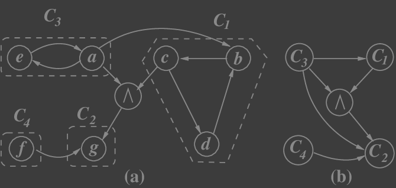

---

- [$\text {Def}$ Graf skierowany](#text-def-graf-skierowany)
- [$\text {Twierdzenie}$ #1](#text-twierdzenie-1)
    - [D-d $\text {Twierdzenia}$ #1](#d-d-text-twierdzenia-1)
- [$\text {Def}$ Szkielet](#text-def-szkielet)
- [$\text {Fakt}$ #1](#text-fakt-1)
- [$\text {Fakt}$ #2](#text-fakt-2)
- [$\text {Def}$ Skierowany graf eulerowski](#text-def-skierowany-graf-eulerowski)
- [$\text {Def}$ Silnie spójny graf](#text-def-silnie-spójny-graf)
- [$\text {Def}$ Kondensacja](#text-def-kondensacja)
- [$\text {Twierdzenie}$ #2](#text-twierdzenie-2)
- [$\text {Def}$ Źródło/ Odpływ](#text-def-źródło-odpływ)
- [$\text {Twierdzenie}$ #3](#text-twierdzenie-3)
    - [D-d $\text {Twierdzenia}$ #3](#d-d-text-twierdzenia-3)
- [$\text {Def}$ Graf orientowalny](#text-def-graf-orientowalny)
- [$\text {Twierdzenie}$ #4](#text-twierdzenie-4)

---

## $\text {Def}$ Graf skierowany

Graf skierowany (digraf $\impliedby$ *directed graph*):\
$G = (V,E,\varphi)$, gdzie $\varphi: E\to V\times V$.\
Zbiór $V$ nazywamy zbiorem wierzchołków, zbiór $E$ nazywamy zbiorem krawędzi skierowanych.

1. Oznaczenia: jeśli $e \in E$ oraz $\varphi(e) = (x,y)$, to $\mathrm{fst}(e) = x$ (ogon $e$) oraz $\mathrm{snd}(e) = y$ (głowa $e$)
2. (stopień wyjściowy, *outdegree*) $\deg^+(v) = |\{e\in E: \mathrm{fst}(e) = x\}|$
3. (stopień wejściowy, *indegree*) $\deg^-(v) = |\{e\in E: \mathrm{snd}(e) = x\}|$
4. Ścieżką w grafie skierowanym nazywamy ciąg $x_0,e_1,x_1,e_2,\dots,e_n,x_n$ taki, że $x_0,\dots,x_n$ są wierzchołkami, $e_1,\dots,e_n$ są krawędziami oraz dla każdego $i \in \{1,\dots,n\}$ mamy $\mathrm{fst}(e_i) = x_{i-1}$ i $\mathrm{snd}(e_i) = x_i$

## $\text {Twierdzenie}$ #1
$$
\sum_{v\in V}\deg^+(v) = |E|
\\
\sum_{v\in V}\deg^-(v) = |E|
$$

### D-d $\text {Twierdzenia}$ #1

$$
|E| = \sum_{v\in V}|\{e\in E: \mathrm{fst}(e) = v\}| = \sum_{v\in V}\deg^+(v).
$$

## $\text {Def}$ Szkielet

Szkieletem **(underlying graph)** grafu skierowanego $G$ nazywamy graf $G^* = (V,E,\varphi^*)$, gdzie $\varphi^*(e) = \{x,y\}$ jeśli $\varphi(e) = (x,y) \lor \varphi(e) = (y,x)$.

## $\text {Fakt}$ #1
Jeśli $G^*$ jest szkieletem digrafu $G$ i $x \in V(G)$ to:
$$
\deg_{G^*}(x) = \deg^+_G(x) + \deg^-_G(x)
$$

## $\text {Fakt}$ #2
Graf skierowany nazywamy spójnym jeśli jego [szkielet](#text-def-szkielet) jest spójny.

## $\text {Def}$ Skierowany graf eulerowski

Skierowanym grafem eulerowskim nazywamy taki graf, w którym istnieje ścieżka zamknięta (początek równa się końcowi) która przechodzi przez wszystkie krawędzie.\
Klasyczne twierdzenie Eulera bez trudu przenosi się na grafy skierowane: są to grafy spójne takie, że $(\forall v\in V)(\deg^-(v) = \deg^+(v))$. Wynika to z faktu, że do z każdego wierzchołka chcemy wyjść tyle samo razy jak i do niego wejść. Jeśli $\deg^-(v) \neq \deg^+(v)$ wówczas w wierzchołku $v$ możemy utknąć lub też pominąć jedną z krawędzi.

//TODO: Sformułuj pojęcie grafu pół-eulerowskiego, sformułuj twierdzenie charakteryzujące grafy pół-eulerowskie i udowodnij je.

## $\text {Def}$ Silnie spójny graf

Graf jest silnie spójny, jeśli dla każdej pary wierzchołków $x,y$ istnieje ścieżka od $x$ do $y$. Podzbiór $X$ $\subseteq E$ jest silnie spójny jeśli obcięcie grafu $G$ do $X$ jest grafem silnie spójnym. Silnie spójną składową nazywamy maksymalny w sensie inkluzji silnie spójny podzbiór zbioru wierzchołków.

## $\text {Def}$ Kondensacja

Kondensacja grafu skierowanego: ustalamy digraf $G=(V,E,\varphi)$

1. Definiujemy $x\gg y \equiv$ istnieje (skierowana) ścieżka od $x$ do $y$
2. Definiujemy $(x \equiv y) \leftrightarrow \big((x\gg y) \land (y\gg x)\big)$
3. Pokazujemy, że relacja $\equiv$ jest relacją równoważności na $V$
4. Pokazujemy, że klasy abstrakcji relacji $\equiv$ pokrywają się z silnie spójnymi składowymi
5. Na $V_{/\equiv}$ definiujemy:
$$
E' = \{(C_1, C_2): (\exists e\in E)(\mathrm{fst}(e) \in C_1 \land \mathrm{snd}(e) \in C_2)\}
$$

Graf $(V_{/\equiv}, E')$ nazywamy kondensacją grafu $G$.

Do znajdowania silnie spójnych składowych można się posłużyć algorytmem Kosaraju lub algorytmem Tarjana.

## $\text {Twierdzenie}$ #2

Kondensacja grafu $G$ jest skierowanym grafem acyklicznym (DAG).

## $\text {Def}$ Źródło/ Odpływ

Źródło to taki wierzchołek $v$, że $\deg^-(v) = 0$.

Odpływ to taki wierzchołek $v$, że $\deg^+(v) = 0$.

## $\text {Twierdzenie}$ #3

W każdym skończonym DAGu istnieje źródło i istnieje odpływ.

### D-d $\text {Twierdzenia}$ #3

Bierzemy skierowaną drogę o największej długości; pokazujemy, że jej początek jest źródłem a końcowy wierzchołek jest odpływem.

## $\text {Def}$ Graf orientowalny

Graf $G$ jest orientowalny jeśli istnieje graf skierowany o zbiorze wierzchołków $V(G)$ którego szkieletem jest $G$.

## $\text {Twierdzenie}$ #4

Graf $G$ jest [orientowalny](#text-def-graf-orientowalny) iff, gdy jest spójny i nie zawiera [mostu](../../definicje/ścieżki/ścieżki.md#bridge) (czyli jest spójny i każda krawędź leży na cyklu).
