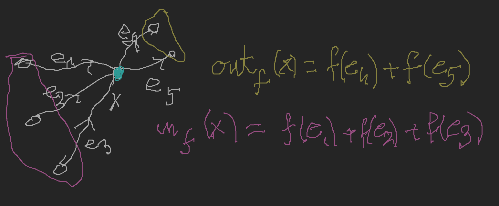

# Przepływy w sieciach
*(2020-05-13)*

## Wersje twierdzenie Mengera dla digrafów
*[oryginalne twierdzenie Mengera](../2020-04-22/twierdzenie-mengera.md#text-twierdzenie-mengera-wersja-wierzchołkowa)*

Ustalamy graf skierowany $\vec{G} = (V, \vec{E})$, zbiory $A,B\subseteq V$:

1. $(A,B)$–droga: ciąg $x_0,e_1,x_1,e_2,\dots,e_n,x_n$ takie, że $x_0 \in A, x_n\in B$ oraz $e_i$ jest krawędzią (skierowaną) od $x_{i-1}$ do $x_i$ czyli tak samo jak dla grafów, z krawędziami zastąpionymi krawędziami skierowanymi
2. Podobnie definiujemy pojęcie $(A,B)$–łącznika wierzchołkowo rozłącznego, krawędziowo rozłącznego, $(A,B)$–separatora wierzchołkowego i separatora krawędziowego.
3. Podstawowe twierdzenie: maksymalna moc $(A,B)$–łącznika jest równa minimalnej mocy $(A,B)$–separatora\
D-d: powtórzenie [dowodu dla grafów](../2020-04-22/twierdzenie-mengera.md#d-d-text-twierdzenia-mengera-wersji-wierzchołkowej) (indukcja po $|\vec{E}|$)

## Oznaczenie #1

Dla digrafu $G = (V,E,\varphi)$ i $X,Y\subseteq V$ zbiór krawędzi z $X$ do $Y$ oznaczamy przez $E(X,Y)$, czyli:
$$
E(X,Y) = \{e\in E: \mathrm{fst}(e) \in X\land \mathrm{snd}(e) \in Y\}.
$$

## Def Separator minimalny

Załóżmy, że $G = (V,E,\varphi)$ jest digrafem, $s,t\in V$ oraz, że zbiór krawędzi $K$ jest $(\{s\},\{t\})$–separatorem. Wówczas istnieje zbiór $X\subseteq V$ taki, że $s\in X, t\in X^\complement = V\setminus X$ oraz $E(X,X^\complement)\subseteq K$.

### D-d separator minimalny

Niech $X = \{x\in V: \text{jest droga od s do x w grafie } G\setminus K\}$. Weźmy krawędź $e$ taką, że $\mathrm{fst}(e) \in X$ oraz $\mathrm{snd}(e) \in X^\complement$:

Wówczas $e \in K$, gdyż inaczej mielibyśmy $y\in X$. Zatem $E(X,X^\complement)\subseteq K$.

## Oznaczenie #2

Niech $(V,E)$ będzie grafem skierowanym i $f: E\to \mathbb{R}$. Niech $X\subseteq V$. Kładziemy $\mathrm{out}_f(X)=\sum\{f(e): e\in E(X,X^\complement)\}$ i $\mathrm{in}_f(X) = \sum\{f(e): e\in E(X^\complement, X)\}$.

Dla uproszczenia notacji definiujemy również $\mathrm{out}_f(x) = \mathrm{out}_f(\{x\})$ i $\mathrm{in}_f(x) = \mathrm{in}_f(\{x\})$.

## Def Pseudo-potok

Niech $G=(V,E)$ będzie grafem skierowanym, $s,t\in V$ i $s\neq t$. Funkcję $f:E\to \mathbb{R}$ nazywamy pseudo-potokiem w $(V,E,s,t)$ jeśli:
$$
(\forall x\in V\setminus\{s,t\})(\mathrm{out}_f(x) = \mathrm{in}_f(x)).
$$

## Fakt #1

Niech $f: E\to \mathbb{R}$ będzie pseudo-potokiem w $(V,E,s,t)$ oraz $X\subseteq V\setminus \{s,t\}$. Wówczas:
$$
\mathrm{out}_f(X) = \mathrm{in}_f(X)
$$

### D-d Faktu #1

Zakładamy najpierw, że nie ma żadnych krawędzi od $s$ do $t$ ani od $t$ do $s$.

Zauważmy, że:
$$
0 = \sum_{x\in X}(\mathrm{out}_f(x) - \mathrm{in}_f(x))
\\= \sum_{x\in X}\left(\sum_{e}f(e)(\lVert\mathrm{fst}(e) = x\rVert - \lVert\mathrm{snd}(e)=x\rVert)\right)
\\= \sum_{e}f(e)\sum_{x\in X}(\lVert\mathrm{fst}(e)=x\rVert - \lVert\mathrm{snd}(e)=x\rVert)
$$

Niech $\alpha(e) = \sum_{x\in X}(\lVert\mathrm{fst}(e)=x\rVert - \lVert\mathrm{snd}(e)=x\rVert)$. Rozważmy dowolną krawędź $e$.\
Jeśli $\mathrm{fst}(e) \notin X$ i $\mathrm{snd}(e)\notin X$ to $\alpha(e) = 0$.\
Jeśli $\mathrm{fst}(e) \in X$ i $\mathrm{snd}(e)\in X$ to $\alpha(e) = 0$.\
Jeśli $\mathrm{fst}(e)\in X$ i $\mathrm{snd}(e)\notin X$ to $\alpha(e)=1$\
Jeśli $\mathrm{fst}(e)\notin X$ i $\mathrm{snd}(e)\in X$ to $\alpha(e) = -1$.

Zatem $0 = \mathrm{out}_f(X)-\mathrm{in}_f(X)$.

Załóżmy teraz, że są jakieś krawędzie od $s$ do $t$ lub od $t$ do $s$. Stosujemy następujący *trick*:

## Twierdzenie #1

Niech $f: E\to \mathbb{R}$ będzie [pseudo-potokiem](#def-pseudo-potok)  w $(V,E,s,t)$. Wówczas:
$$
\mathrm{out}_f(s) - \mathrm{in}_f(s) = -(\mathrm{out}_f(t) - \mathrm{in}_f(t)).
$$

### D-d Twierdzenia #1

Stosujemy [poprzedni fakt](#fakt-1) do zbioru $X=V\setminus \{s,t\}$. Zauważamy, że $\mathrm{out}_f(X) = \mathrm{in}_f(s) + \mathrm{in}_f(t)$ oraz $\mathrm{in}_f(X)=\mathrm{out}_f(s)+\mathrm{out}_f(t)$.

## Def Wartość $f$

Jeśli $f$ jest [pseudo-potokiem](#def-pseudo-potok) w $(V,E,s,t)$ to liczbę $\mathrm{out}_f(s) - \mathrm{in}_f(s)$ nazywamy wartością $f$ i oznaczamy ją przez $\lVert f\rVert$

Liczbę tę możemy interpretować jako produktywność źródła bądź jako konsumpcję ujścia. Równość z poprzedniego twierdzenia możemy interpretować tak: „ilość tego co wyprodukuje źródło jest równa ilości tego co pochłania ujście.

## Def Sieć

Siecią nazywamy $\mathcal{N} = (V,E,s,t,c)$ taką, że $(V,E)$ jest digrafem, $s,t \in V$, $s\neq t$ oraz $c: E \to [0,\infty) \cup \{\infty\}$

## Def Potok

Jeśli $\mathcal{N} = (V,E,s,t,c)$ jest siecią, to funkcję $f: E\to [0,\infty]$ nazywamy potokiem w $\mathcal{N}$ jeśli $f$ jest [pseudo-potokiem](#def-pseudo-potok) w $(V,E,s,t)$ oraz $(\forall e \in E)(0\le f(e) \le c(e))$.

**Zadanie optymalizacyjne, które będzie rozważane na dalszych wykładach: mamy daną sieć $\mathcal{N}$. Chcemy znaleźć przepływ przez $\mathcal{N}$ o największej wartości.**

## Twierdzenie #2

Niech $\mathcal{N}$ będzie siecią (skończoną). Istnieje wtedy przepływ $f^* w \mathcal{N}$ taki, że:
$$
\lVert f^* \rVert = \sup\{ \lVert f \rVert: f \text{ jest potokiem w } \mathcal{N} \}
$$

## Def Ścieżka powiększająca

Ścieżką powiększającą potoku $f$ nazywamy ciąg $x_0 e_1 x_1 e_2\dots e_n x_n$ taki, że $x_0 = s, x_n = t$ oraz dla każdego $i = 1,\dots,n$ mamy:
$$
( \varphi(e_i) = (x_{i-1}, x_i) \land f(e_i) < c(e_i) ) \lor ( \varphi(e_i) = (x_i, x_{i-1}) \land f(e_i) > 0 ).
$$
Zapasem takiego potoku nazywamy liczbę $\delta = \min\{ \delta_1,\dots, \delta_n \}$ gdzie
$$
\delta_i =
\begin{cases}
  c(e_i) - f(e_i) &: \varphi(e_i) = (x_{i-1}, x_i)\\
  f(e_i) &: \varphi(e_i) = (x_i, x_{i-1})
\end{cases}
$$

## Fakt #2

Jeśli istnieje ścieżka powiększająca dla potoku $f$ o zapasie $\delta > 0$, to istnieje potok $f^*$ taki, że $\lVert f^* \rVert = \lVert f \rVert + \delta$.

Obserwacja ta jest podstawą metody Forda-Fulkersona szukania potoków maksymalnych.
