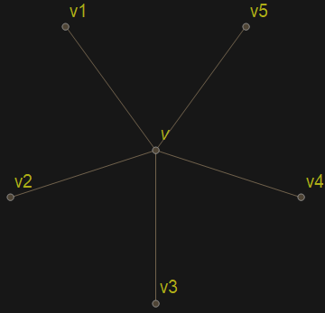

---

- [Twierdzenie Brooks 1941](#twierdzenie-brooks-1941)
- [Twierdzenie #2](#twierdzenie-2)
    - [Szkic Dowodu Twierdzenia #2](#szkic-dowodu-twierdzenia-2)
- [Twierdzenie Appel-Haken 1976](#twierdzenie-appel-haken-1976)

---

## Twierdzenie Brooks 1941

Załóżmy, że $k = \Delta(G) \ge 3$ oraz, że $G$ nie zawiera pod-grafu izomorficznego z $K_{k+1}$. Wtedy $\mathcal{X}(G) \le \Delta(G)$.

[D-d by Mariusz Zając](https://arxiv.org/pdf/1805.11176.pdf)

## Twierdzenie #2
Jeśli graf $G$ jest grafem planarnym, to $\mathcal{X}(G) \le 5$.

Zajmujemy się dowodem tego twierdzenia, bo jest on przykładem nieco trudniejszego, ale za to dosyć typowego rozumowania z teorii grafów.

### Szkic Dowodu Twierdzenia #2

Robimy indukcję po liczbie wierzchołków.

Jeśli $|V(G)| \le 5$, to twierdzenie jest oczywiście prawdziwe. Załóżmy teraz, że twierdzenie jest prawdziwe dla wszystkich grafów planarnych o mniej niż $k$ wierzchołkach.

1. Rozważamy graf $G$ o $k>5$ wierzchołkach. Wybierany w nim wierzchołek $v$ taki, że $\deg(v) \le 5$.\
Oznaczmy $G' = G[V\setminus\{v\}]$. Z założenia indukcyjnego mamy właściwe kolorowanie $c$ grafu $G'$ za pomocą kolorów ze zbioru $\{1,2,3,4,5\}$.
2. Jeśli $\deg(v) < 5$ to bez trudu rozszerzamy $c$ do właściwego kolorowanie grafu $G$.
3. Możemy więc założyć, że $\deg(v) = 5$.

    
4. Niech $\mathcal{N}(v) = \{ v_1, v_2, v_3, v_4, v_5 \}$. Jeśli $\{ c(v_1), c(v_2), c(v_3), c(v_4), c(v_5) \} \neq \{1,2,3,4,5\}$ to znowu bez trudu rozszerzamy $c$ do właściwego kolorowania grafu $G$.
5. Możemy więc założyć, że $\{ c(v_1), c(v_2), c(v_3), c(v_4), c(v_5) \} = \{1,2,3,4,5\}$. Permutując kolory możemy założyć, że $c(v_i) = i$ dla $i = 1,\dots,5$.
6. Dla $1 \le i \le 5$ definiujemy
    $$
    C_{i,j} = \{ x\in V \setminus \{v\}: c(x) \in \{i,j\} \}.
    $$
    Przyglądamy się pod-grafowi $G[C_{i,j}]$. Mamy $\{v_i,v_j\} \subseteq C_{i,j}$.\
    Jeśli $v_i$ oraz $v_j$ leżą w różnych składowych spójnych grafu $G[C_{i,j}]$, to możemy w obrębie tego grafy tak pozmieniać kolorowanie (używając tylko kolorów $i$ oraz $j$) aby wierzchołki $v_i$ oraz $v_j$ otrzymały ten sam kolor! A wtedy do kolorowania $\{v_1,\dots,v_5\}$ używamy tylko 4 kolory, więc możemy rozszerzyć kolorowanie grafu $G[V\setminus\{v\}]$ na cały graf $G$.
7. Możemy więc założyć, że wierzchołki $v_i$ oraz $v_j$ leżą w tych samych składowych spójnych grafu $G[C_{i,j}]$. Dla każdej pary $1 \le i \le j \le 5$ ustalmy drogę $P_{i,j}$ w $C_{i,j}$. Zauważamy, że do kolorowania $P_{i,j}$ używamy tylko kolorów $i$ oraz $j$. Każda ścieżka $P_{i,j}$ odpowiada pewnej [krzywej jordanowskiej](../2020-04-01/2020-04-01.md#krzywa-jordana) $J_{i,j}$ na płaszczyźnie. **Ale graf $K_5$ nie jest planarny.** Znajdujemy więc dwie pary $\{i_1,j_1\}$ oraz $\{i_2, j_2\}$ takie, że $\{i_1,j_1\} \cap \{i_2,j_2\} = \emptyset$ oraz, że $J_{i_1,j_1} \neq \emptyset$. Krzywe $J_{i_1,j_1}$ oraz $J_{i_2,j_2}$ muszą się więc przeciąć w pewnym wierzchołku.\
Ale ścieżki $P_{i_1,j_1}$ i $P_{i_2,j_2}$ są pokolorowane różnymi kolorami $\implies$ **sprzeczność** .

## Twierdzenie Appel-Haken 1976

Jeśli graf $G$ jest grafem planarnym, to $\mathcal{X}(G) \le 4$.

Twierdzenie to jest potwierdzeniem hipotezy Francis'a Guthrie z roku 1852.\
Do udowodnienia twierdzenia Appel i Haken wykorzystali komputer, którym posłużyli się do rozważenia około 1600 specyficznych konfiguracji (podobnych do pod-grafu $K_{1,5}$, który wykorzystywaliśmy w dowodzie poprzedniego twierdzenia). Całkiem dobrą dyskusję na temat tej historii można znaleźć [tutaj](https://en.wikipedia.org/wiki/Four_color_theorem).

Aby zastosować twierdzenie Appel-Haken do klasycznego (popularnego) sformułowania Twierdzenia o Czterech Barwach należy jest zastosować do grafu dualnego ([wiki](https://en.wikipedia.org/wiki/Dual_graph)) do danego grafu planarnego:

